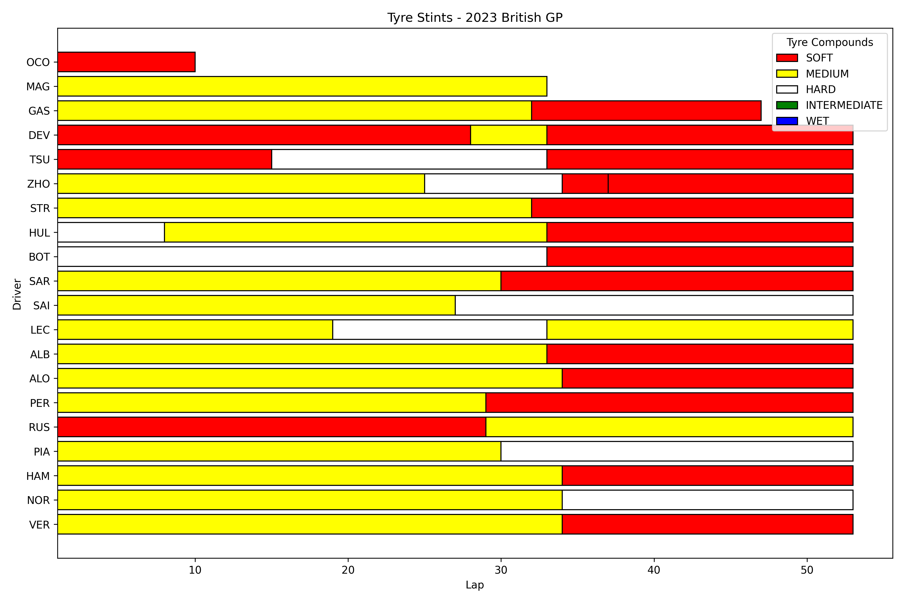
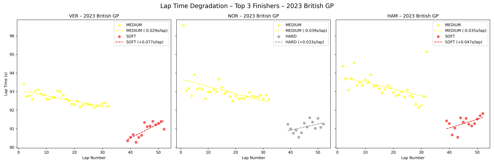

# f1-strategy-simulator
Python-based F1 race analysis and strategy simulation using FastF1 data

# F1 Strategy Simulator – Tyre Stint Analysis

This project uses [FastF1](https://theoehrly.github.io/Fast-F1/) to analyse F1 race data.

## Example: 2023 British Grand Prix
Tyre stint chart generated with Python:

## How it Works
- Downloads F1 telemetry data using FastF1
- Groups stints by tyre compound
- Plots each driver’s tyre usage across the race

---

# F1 Strategy Simulator – Tyre Degradation Analysis (Top 3 Finishers)

Example: 2023 British Grand Prix – VER, NOR, HAM

### Plot

### Degradation Rates (s/lap)

| Driver | HARD   | MEDIUM  | SOFT  |
|--------|--------|---------|-------|
| HAM    | –      | -0.035  | 0.047 |
| NOR    | 0.033  | -0.039  | –     |
| VER    | –      | -0.029  | 0.077 |

---

## Next Steps
- Add lap time degradation curves for more drivers
- Build a basic pit stop strategy model
- Simulate alternate race strategies
- Analyse Safety Car impact on strategy
